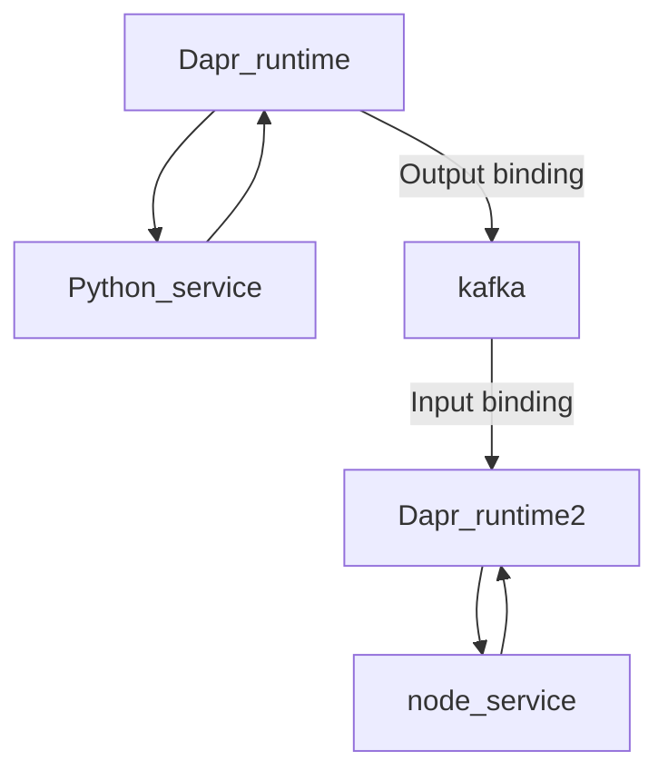

Dapr bindings are a way to connect your applications to external resources
-   **Messaging systems:** Dapr can bind to messaging systems like Azure Service Bus, Kafka, RabbitMQ, and Redis Pub/Sub. This allows your applications to receive events from and send events to external systems.
-   **State stores:** Dapr can bind to state stores like Azure Cosmos DB, Redis, and MySQL. This allows your applications to persist data in a consistent and scalable way.
-   **Secrets management:** Dapr can bind to secrets management systems like Azure Key Vault and HashiCorp Vault. This allows your applications to securely access secrets without having to hard-code them in your code.
-   **HTTP/gRPC:** Dapr can bind to HTTP and gRPC endpoints. This allows your applications to interact with other services over the network.

## Building block 
-   The input binding triggers a method on your application.
-   Execute output binding operations on the component

## Dapr output bindings component 

