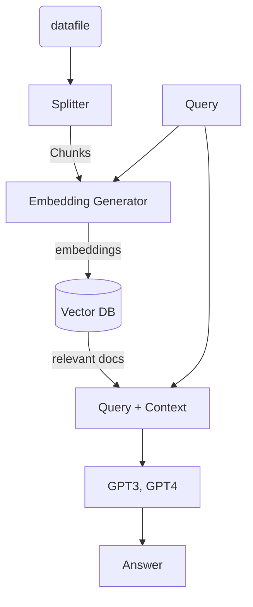

# Chatbot from custom Knowledge Base

# Report Structure
1. Introduction
	1. Image retrieval 
	2. Related method
2. Methodology 
	1. Diffusion method for image retrieval
	2. Dimension reduction
3. Experiment and result
	1. Dataset 
	2. Evaluation
4. Conclusion
5. Citation

DDPG uses an actor-critic architecture maintaining a deterministic policy(actor) and an action-value function approximation(critic)

### Data mapping whitelabel -> chain merchant transaction 

**whitelabel record**:

txn_id -> txn_id

txn_w4_id 

txn_status -> txn_status

txn_amount -> txn_amount

txn_campaign_id

txn_voucher_amount

txn_cashback_amount

txn_date -> txn_date 

merchant_id -> txn_bank_mid

merchant_type -> "PARTNER"

partner_code -> txn_partner_id

customer_id

txn_partner_channel -> "WSP"

branch_id

txn_response_code -> txn_response_code

txn_org_amount -> txn_org_amount

extras_categories

cus_user_type

cus_user_type_biz

txn_type -> txn_customer_type