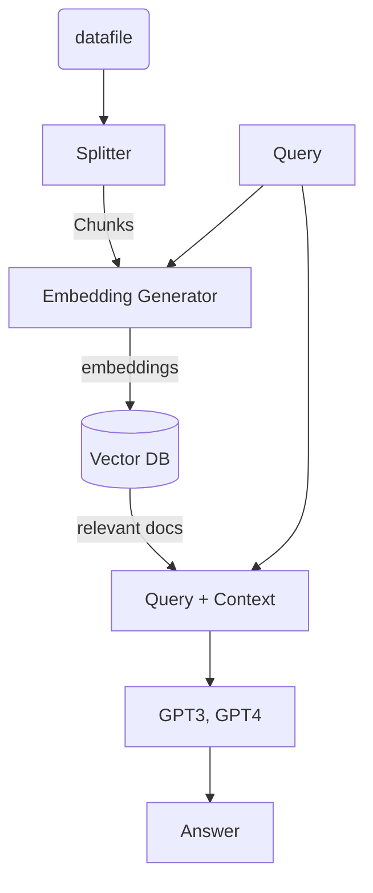

# Chatbot from custom Knowledge Base

# Report Structure
1. Introduction
	1. Image retrieval 
	2. Related method
2. Methodology 
	1. Diffusion method for image retrieval
	2. Dimension reduction
3. Experiment and result
	1. Dataset 
	2. Evaluation
4. Conclusion
5. Citation

